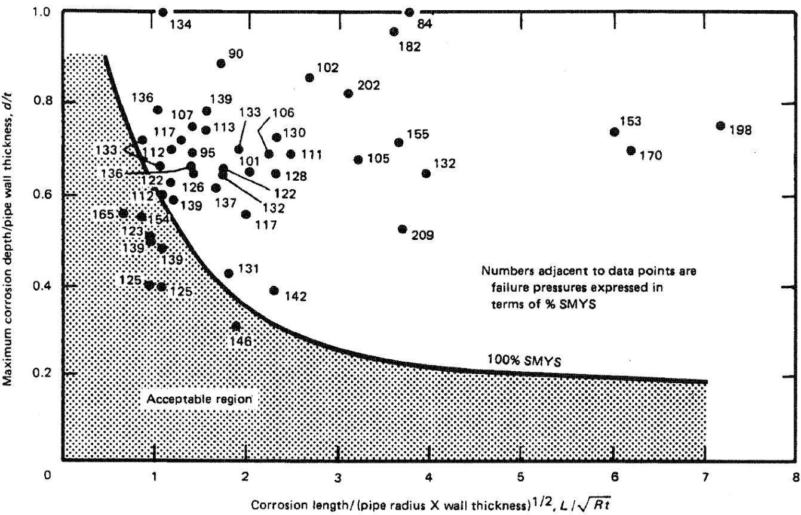

# PipelineIntegrity library
[](https://github.com/vb64/pipeline.integrity/actions?query=workflow%3Apep257)
[](https://github.com/vb64/pipeline.integrity/actions?query=workflow%3Apy2)
[](https://github.com/vb64/pipeline.integrity/actions?query=workflow%3Apy3)
[](https://app.codacy.com/gh/vb64/pipeline.integrity/dashboard?utm_source=gh&utm_medium=referral&utm_content=&utm_campaign=Badge_grade)
[](https://app.codacy.com/gh/vb64/pipeline.integrity/dashboard?utm_source=gh&utm_medium=referral&utm_content=&utm_campaign=Badge_coverage)

[In Russian](READMEru.md)

The free, open source PipelineIntegrity library designed to calculate the degree of danger
of pipeline metal loss defects according to the ASME B31G method.



## Installation

```bash
pip install pipeline-integrity
```

## Usage

A pipe under pressure, with a length, diameter and wall thickness from specified material.

```python
from pipeline_integrity.material import Material
from pipeline_integrity.pipe import Pipe

pipe = Pipe(
  440,  # length, inches
  56,  # diameter, inches
  0.63,  # wall thickness, inches
  Material(  # pipe material
    "Steel",
    52000  # SMYS, psi
  ),
  900  # pressure, psi
)
)
```

Metal loss defect with a specified position on the pipe and a specified depth.

```python
defect = pipe.add_metal_loss(
  40,  # the defect starts at a distance of 40 inches from the beginning of the pipe
  4,  # defect length 4 inches
  10,  # along the circumference of the pipe, the defect begins
       # at 10 arc minutes from the top of the pipe
  20,  # the size of the defect along the circumference is 20 arc minutes
  0.039  # defect depth 0.039 inches
)
```

SMTS for pipe material must be set to create
context for calculating the degree of severity of the defect according to the ASME B31G method

```python
from pipeline_integrity.method.asme.b31g_2012 import Context

pipe.material.smts = 70000
asme = Context(defect)
```

Defect depth less than 10% wall thickness, no danger.

```python
assert defect.depth == 0.039
assert pipe.wallthickness == 0.63

assert asme.years() > 0
assert 0.7 < asme.erf() < 0.71
```

For very low pressure cases, repair is never required (special value REPAIR_NOT_REQUIRED=777).

```python
pipe.maop = 1
assert asme.years() == asme.REPAIR_NOT_REQUIRED
```

The depth of the defect is 50% of the pipe wall thickness.

```python
pipe.maop = 900
defect.depth = 0.31
assert defect.length == 4
assert 0.74 < asme.erf() < 0.75
```

A defect with a length of 30 inches and a depth of 50% of the pipe wall thickness
requires repair at the specified working pressure in the pipe.

```python
defect.length = 30
assert asme.years() == 0
assert asme.erf() > 1.3
```

When the operating pressure is reduced to a safe value, the defect does not require repair.

```python
assert pipe.maop == 900
assert round(asme.safe_pressure, 2) == 653.71
pipe.maop = 500
asme.is_explain = True
assert asme.years() > 0
```

If you set context property `is_explain = True`, then you can get explanation in text form.

```python
asme.explain()
```

```text
Calculate ERF by ASME B31G 2012 classic.
Calculate failure stress level by the classic way.
Parameter Sflow = 1.1 * material_smys.
Sflow = 1.1 * 52000 = 57200.0.
Parameter Z = length^2 / (diameter * wallthickness).
Z = 30^2 / (56 * 0.63) = 25.51.
Parameter Z = 25.51 > 20.
Failure stress level = Sflow * (1 - depth / wallthickness).
stress_fail = 57200.0 * (1 - 0.31 / 0.63) = 29053.968.
Failure pressure = 2 * stress_fail * wallthickness / diameter.
press_fail = 2 * 29053.968 * 0.63 / 56 = 653.714.
ERF = pipe_maop / press_fail.
ERF = 500 / 653.714 = 0.765

Repair is not required at the moment, calculate the time before repair.
With corrosion rate 0.016 mm/year, pipe wall 0.63 and depth 0.31 a through hole is formed after years: 21.
Calculating the year in which the corrosion growth of the defect will require repair.
Years: 4 ERF: 0.952.
Years: 5 ERF: 1.014.
Defect will require repair after years: 4.
```

## Development

```
git clone git@github.com:vb64/pipeline.integrity.git
cd pipeline.integrity
```
With Python 3:
```
make setup PYTHON_BIN=/path/to/python3
make tests
```
With Python 2:
```
make setup2 PYTHON_BIN=/path/to/python2
make tests2
```

## Example

Living version of online calculator example, that use this library, can be [found here](https://wot-online-hours.appspot.com/).
The source code of this example placed in this repo in [example dir](example/web/gae ).
