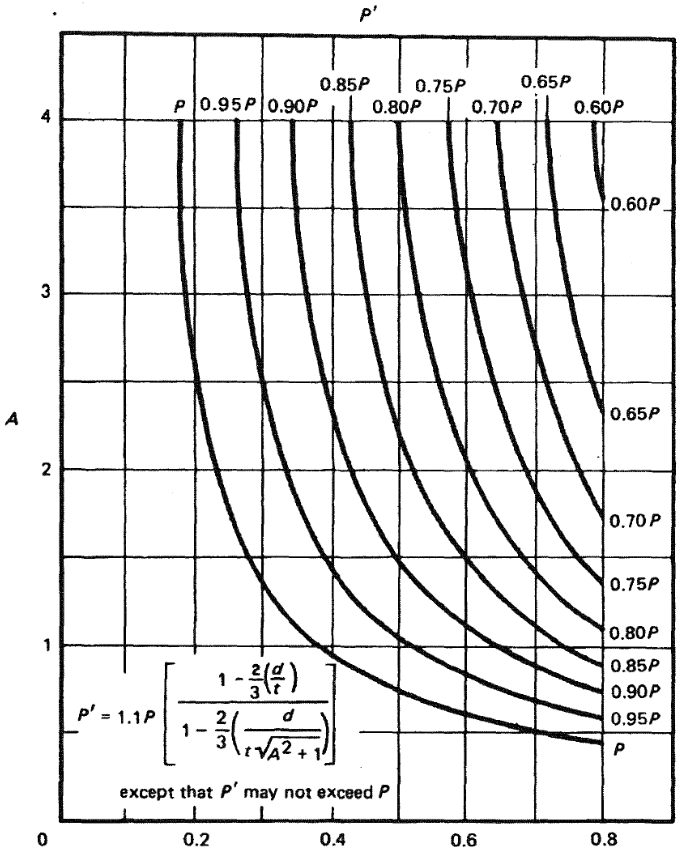

# ASME B31G

Source: https://github.com/vb64/pipeline.integrity/blob/main/docs/asme.b31g.1991.pdf

## PART 1 INTRODUCTION

### FOREWORD

It is recognized by pipeline companies that some sections of high pressure pipelines particularly those installed a number of years ago, have experienced some corrosion.
Where corrosion is found, pipeline operators have been deeply concerned about the need for a method of determining the remaining strength of these corroded areas.
If the corrosion does not penetrate the pipe wall, what is the pressure containing capability of the remaining pipe metal in tenns of its ability
to continue to operate safely at the maximum allowable operating pressure (MAOP) of the pipeline system?
Thus, one of the needs of the pipeline industry has been a procedure that will help operators, particularly field personnel, make decisions on existing pipelines,
when exposed for any purpose, as to whether any corroded region may be left in service or whether it needs to be repaired or replaced.
Such detenninations must be based upon sound research and extensive testing in order to provide safe and conservative guidelines on which to base field decisions.
The Manual provides procedures to assist in this determination.

Parts 2, 3, and 4 are based on Appendices G-6, G-7, and 0-8 of the ASME Guide for Gas Transmission and Distribution Piping Systems, 1983 Edition.
They are included in this Manual for use by field operators to determine the remaining strength of corroded pipe.
The technology is based on research done in the Columbus laboratories of the Battelle Memorial Institute; specifically,
their report Summary of Research to Detennine the Strength of Corroded Areas in Line Pipe, July 10, 1971.

A revision to the 1984 edition of the Manual was undertaken in 1989.
The revision includes a number of clarifications and corrections.
The computer program presented in Appendix B and used to produce a printed table of maximum acceptable corrosion lengths for a given pipe diameter,
and up to ten wall thicknesses of that diameter, was upgraded.

This Manual was approved by ASME and subsequently by the American National
Standards Institute on May 20, 1991.

### SCOPE

The scope of this Manual includes all pipelines within the scope of the pipeline codes that are part of ASME B31 Code for Pressure Piping,
i.e., ASME B31.4, Liquid Transportation Systems for Hydrocarbons, Liquid Petroleum Gas, Anhydrous Ammonia, and Alcohols;
ASME B31.8, Gas Transmission and Distribution Piping Systems; and ASME B31.11, Slurry Transportation Piping Systems.
Parts 2, 3, and 4 are based on material included in ASME Guide for Gas Transmission and Distribution Piping Systems, 1983 Edition.

This Manual is not applicable to new construction covered under the B31 Code Sections.
That is, it is not intended that this Manual be used to establish acceptance standards for pipe that, may have become corroded prior to or during fabrication and/or installation.
This Manual is intended solely for the purpose of providing guideline information for the designer/owner/operator.
Thus, the specific use of this Manual is the responsibility of the designer/owner/operator.

### LIMITATIONS

(a) This Manual is limited to corrosion on weldable pipeline steels categorized as carbon steels or high strength low alloy steels.
Typical of these materials are those described in ASTM A 53, A 106, and A 381, and API SL. (The current API SL includes all Grades formerly in API 5LX and 5LS.)

(b) This Manual applies only to defects in the body of line pipe which have relatively smooth contours and cause low stress concentration
(e.g., electrolytic or galvanic corrosion, loss of wall thickness due to erosion).

(c) This procedure should not be used to evaluate the remaining strength of corroded girth or longitudinal welds or related heat affected zones,
defects caused by mechanical damage, such as gouges and grooves, and defects introduced during pipe or plate manufacture, such as seams, laps, rolled ends, scabs, or slivers.

(d) The criteria for corroded pipe to remain in service presented in this Manual are based only upon the ability of the pipe to maintain structural integrity under internal pressure.
It should not be the sole criterion when the pipe is subject to significant secondary stresses (e.g., bending), particularly if the corrosion has a significant transverse component.

(e) This procedure does not predict leaks or rupture failures.

### INITIAL DEVELOPMENT

In the late 1960s, a major long-lines gas transmission pipeline company in conjunction with the Battelle Memorial Institute in Columbus,
Ohio 7 began a research effort to examine the fracture initiation behavior of various kinds of corrosion defects in line pipe.
This included determining the relationship between the size of a defect and the level of internal pressure that would cause the defect to leak or rupture.
The testing by the gas pipeline company and Battelle demonstrated that there was indeed a possibility of developing methodology and procedures
to analyze varying degrees of corrosion of existing pipelines.
From this, an operator could make a valid determination as to whether the pipelines could safely remain in service or should be repaired or replaced.
As the awareness of this research program grew, other transmission companies began to express considerable interest.

Beginning in the early 1970s, the American Gas Association (AGA) Pipeline Research Committee assumed responsibility for this activity
and began developing methods for predicting the pressure strength of line pipe containing various sizes of corrosion defects.

The overall objective of these experiments was to examine the fracture initiation behavior of various sizes of corrosion defects by determining
the relationship between the size of a defect and the level of internal pressure that would cause a leak or rupture.

### METHODOLOGY AND RESEARCH PROCEDURES

The procedure contained in this Manual is based upon pressuring actual corroded pipe to failure in an extensive series of full-size tests.
Since there was pipe available that had been removed from service and that had sustained corrosion damage, it seemed more logical to test these full-size,
actual field specimens, either in place or in a large, fullscale test cell, rather than base these guidelines upon purely laboratory tests using machined defects.
Several hundred full-scale pipe tests were conducted on all types of defects to establish general defect behavior.
Mathematical expressions to calculate the pressure strength of corroded pipe materials were developed on the basis of these extensive tests.
These mathematical expressions, although semiempirical, were founded upon well established principles of fracture mechanics.
The basis principle of fracture mechanics is that the resistance of the material to unstable fracturing in the presence of a defect is related to the size of the defect
and an inherent metal property called toughness.
The tougher the material, the larger the flaw that can be tolerated before failure will occur.
Also, the bigger the defect, the lower the pressure at which a leak or rupture will occur.
These two features may seem obvious, but they form the basis of fracture mechanics in terms of detennining the real strength of pipe containing defects.

During 1970 and 1971, 47 pressure tests were conducted on several pipe sizes to evaluate the effectiveness of the mathematical expressions in determining the strength of corroded areas.
The diameter of the pipe material examined ranged from 16 in. through 30 in. and wall thickness varied from 0.312 in. through 0.375 in.
The pipe materials have ranged in yield strength from about 25,000 psi for API 5L Grade A-25 to about 52,000 psi for 5LX Grade X-52.

The mathematical expressions developed from the earlier experiments have been modified based on later test results and now provide reliable estimates of the failure pressures
for corrosion defects over the range of materials covered in this study.
The experiments on corroded pipe indicated that line pipe steels have adequate toughness and that the toughness is not a significant factor.
The failure of blunt corrosion flaws is controlled by their size and the flow stress or yield stress of the material.


_FIG.1-1 PARABOLIC CRITERIA FOR CLASSIFYING CORROSION DEFECTS ACCORDING TO PREDICTED FAILURE STRESS_

Figure 1-1 shows the relationship between the full-size test failures and the criterion for acceptance of corrosion pits in line pipe.
The criterion is that they shall withstand a pressure equal to a stress level of 100% of the specified minimum yield stress (SMYS).
The Figure is based on an assured parabolic profile of the corroded regions and presents the maximum corrosion depth, divided by the pipe wall thickness,
plotted against the corrosion length, divided by the square root of the pipe radius times wall thickness.
Each of the data points plotted represents one full-size pipe experiment on corroded pipe, and the number next to the data point represents the stress at failure pressure expressed as percent SMYS.
There are only 3 data points (experiments) that failed at pressure levels below 100% SMYS, indicating the lack of severity of corrosion defects in general
(note that all three would be rejected by this criterion).
The solid line shown on the Figure is the line that identifies failure pressures of less than 100% SMYS.
There are a number of data points that are below this line, but all of them represent failures above 100% SMYS.
The fact that these are above 100% SMYS simply indicates that the criterion is very conservative.

The acceptable region in the plot is the shaded region below and to the left of the solid line.
The Tables in Part 3 are based on corrosion depths and lengths determined by this solid line.
Corrosion pits that have depths and lengths that fall above the curve are not acceptable, in accordance with the criteria presented herein,
and the operating pressure either has to be reduced, or the corrosion pit removed or repaired.

### HOW TO USE THE MANUAL

Part 2, Determination of Maximum Allowable Longitudinal Extent of Corrosion, sets forth the equations for determining the severity of the corroded areas.
It tells the operator how to measure the longitudinal extent and maximum depth of the corroded areas.
One can then use Eq.(2) of Part 2 to determine if the corroded area is serious.

However, it is recognized that most field operators will prefer a simpler method of evaluating a corroded area.
Therefore, Part 3, Tables for Corrosion Limits, evaluates Eq.(2) and places the results in tabular form.
This allows the field operator to make decisions simply by going to a table after measuring the longitudinal extent and maximum depth of the corroded area and making a choice.

Locate the table appropriate for the pipe O.D. and wall thickness.
Look down the left column and find the depth of corrosion that is equal to or the next number larger than the measured maximum depth of the corroded area.
Read across to the column headed by the wall thickness or next number lower than the pipe's nominal wall thickness
to determine the maximum allowable longitudinal extent of the corroded area for the depth of corrosion.
If the measured longitudinal extent of the corroded area is equal to or less than the maximum allowable longitudinal extent of the corroded area
determined from the Table, the pipe strength is suitable for the present MAOP and is capable of containing a test pressure that win produce a stress of 100% SMYS of the pipe material.

As used in this manual, the term MAOP shall represent maximum steady state operating pressure for pipelines within the scope
of ASME B31.4 and ASME B31.11 and maximum allowable operating pressure for pipelines within the scope of ASME B31.8.

The tables produce results which may be more conservative than Eq.(2) of Part 2.
The tables could show that the corroded area is unsuitable for the current MAOP, but Eq. (2) may show that it is.
Therefore, it is possible for the corroded region to be rejected by the tables, but found suitable by using Eq.(2).

If the tables and Eq.(2) both show the corroded region to be unsuitabe, it may still be possible to establish suitability by one of the methods mentioned in para. 1.7.
Another alternative would be to lower the MAOP of the pipeline, if permitted by operating conditions.
Part 4 can be used to determine a lower MAOP that has the same safety factor provided by Parts 2 and 3.

Regardless of which alternative is chosen, in all cases where the corroded region is to be left in service, measures should be taken to arrest further corrosion.
Such measures should include coating the corroded region and, if indicated, increasing the cathodic protection level.


_FIG.1-2 PROCEDURE FOR ANALYSIS OF CORRODED PIPE STRENGTH_

Figure 1-2, Procedure for Analysis of Corroded Pipe Strength, shows the steps necessary to proceed through the evaluation of a corroded area
on a pipeline in order to determine if any corrective action is needed.
The steps shown in the dashed boxes are valid means of determining a safe operating pressure (or MAOP),
but the procedures for conducting these steps or the acceptance levels are not in this Manual.

### THE MEANING OF ACCEPTANCE

(a) Any corroded region indicated as acceptable by the criteria of this Manual for service at the established MAOP is capable of withstanding
a hydrostatic pressure test that will produce a stress of 100% of the pipe SMYS.

(b) Any corroded region indicated as acceptable for service at a reduced MAOP is capable of withstanding a hydrostatic pressure test
at a ratio above the MAOP equal to the ratio of a 100% SMYS test to 72% SMYS operation (1.39:1).
If a larger ratio is desired, the reduced MAOP can be adjusted accordingly.

### OTHER MEANS OF DETERMINING SAFE PIPELINE OPERATING PRESSURE

(a) The operator can make a more rigorous analysis of the corroded area to determine the remaining strength by performing a fracture mechanics
analysis based upon established principles and practices using the actual profile of the corroded region.

(b) The operator can reestablish the MAOP by a complete hydrostatic pressure test that produces a minimum stress of 100% SMYS,
or establish a lower MAOP based on the pressure of a successful test conducted at a lower pressure.

(e) The procedures and acceptance criteria for conducting these alternative acceptance tests, either fracture mechanics analysis or hydrostatic tests,
are not included in this Manual.

### COMPUTER PROGRAMS

Appendix A is a BASIC computer program, CRVL.BAS, developed by Mr. Richard L. Seifert and is based on the equations in Parts 2 and 4.
It can be used to expedite the evaluation procedure. Several examples of the program output are shown.

Appendix B is a BASIC computer program, CRLGTHU.BAS by Mr. Seifert, which is an upgrade of CRLGTH.BAS, which was contained in the first printing of this Manual.
CRLGTH.BAS was used to produce some of the tables in Part 3.
It required that the BASIC program be modified slightly each time it was used.
The new program CRLGTHU.BAS does not require modification.
It will produce a printed table of maximum acceptable corrosion lengths for a given pipe diameter, and up to ten wall thicknesses of that diameter.
An example of a printed table by this program is included at the end of Appendix B.

Both CRVL.BAS and CRLGTHU.BAS were written in BASIC for a specific computer/printer combination and can be utilized by most state-of-the-art microprocessors.
However, minor modifications may be necessary for use on other equipment or for other purposes.

These computer programs are reproduced herein solely for the convenience of the Manual user, and ASME and the auther make no claims as to their accuracy or effectiveness.

## PART 2 DETERMINATION OF MAXIMUM ALLOWABLE LONGITUDINAL EXTENT OF CORROSION

The depth of a corrosion pit may be expressed as a percent of the nominal wallthickness of the pipe by:


where

-   d = measured maximum depth of the corroded area, in., as shown in Fig.2-1
-   t = nominal wall thickness of the pipe, in. Additional wall thickness required for concurrent external loads shaH not be included in the calculations.

A contiguous corroded area having a maximum depth of more than 10% but less than 80% of the nominal wall thickness of the pipe
should not extend along the longitudinal axis of the pipe for a distance greater than that calculated from:


L may also be determined from Tables 3-1 through 3-12 in Part 3.

where

-   L = maximum allowable longitudinal extent of the corroded area, in., collinear with Lm in Fig.2-1
-   D = nominal outside diameter of the pipe, in.
-   B = a value which may be determined from the curve in Fig.2-2 or from:


except that B may not exceed the value 4.
If the corrosion depth is between 10% and 17.5%, use B = 4.0 in Eq.(2).


_FIG.2-1 CORROSION PARAMETERS USED IN ANALYSIS_


_FIG.2-2 CURVE FOR DETERMINING THE VALUE B_

## PART 3 TABLES FOR CORROSION LIMITS

The tables in this Part are calculated from the equations in Part 2.
They provide a ready reference of maximum corrosion lengths for a spectrum of pipe diameters, wallthicknesses, and pit depths.
These Tables may be used to determine the maximum allowable longitudinal extent of a contiguous area of corrosion as given in Part 2.

(a) The corroded area must be clean to bare metal. Care should be taken when cleaning corroded areas of a pressurized pipeline.

(b) Measure the maximum depth of the corroded area d and the longitudinal extent of the corroded area as shown in Fig.2-1.

(e) Determine the size (NPS) of the pipe and nominal wall thickness.

(d) Turn to the page in the Table corresponding to the size (NPS) of the pipe.

(e) Locate the row showing a depth equal to the measured maximum depth of the corroded area.
If the exact measured value is not listed, choose the row showing the NEXT GREATER DEPTH.

(f) Scan across to the column showing the waIl thickness of the pipe.
If the nominal wall thickness is not listed, use the column for the NEXT THINNER WALL.
The value L found at the intersection of the wall thickness column and depth row is the maximum allowable longitudinal extent of such a corroded area.

(g) The tables in Part 3 produce results which may be more conservative than those obtained from the equations in Part 2.
Therefore, the tables could show that a given corroded area is unsuitable for the current MAOP, but the use of the equations in Part 2 may show that it is acceptable.

TABLE 3-1 VALUES OF L FOR PIPE SIZES >= NPS 2 AND < NPS 6

Wall Thickness t, in.

Depth d, in | 0.083 | 0.109   | 0.125   | 0.141   | 0.154   | 0.172   | 0.188   | 0.218
:---        | ---:  | ---:    | ---:    | ---:    | ---:    | ---:    | ---:    | ---:
0.01        | 2     |  -      | -       | -       | -       | -       | -       | -
0.02        | 15/16 |  1+15/16| 2+7/16  | 2+9/16  | 2+11/16 | 2+7/8   | 3       | -
0.03        | 1/2   |  7/8    | 1+1/8   | 1+1/2   | 1+15/16 | 2+7/8   | 3       | 3+1/4
0.04        | 3/8   |  5/8    | 3/4     | 15/16   | 1+1/8   | 1+3/8   | 1+3/4   | 2+3/4
0.05        | 5/16  |  7/16   | 9/16    | 11/16   | 13/16   | 1       | 1+3/16  | 1+5/8

TABLE 3-2 VALUES OF L FOR PIPE SIZES >= NPS 6 AND < NPS 10

TABLE 3-3 VALUES OF L FOR PIPE SIZES >= NPS 10 AND < NPS 16

TABLE 3-4 VALUES OF L FOR PIPE SIZES >= NPS 16 AND < NPS 20

TABLE 3-5 VALUES OF L FOR PIPE SIZES >= NPS 20 AND < NPS 24

TABLE 3-6 VALUES OF L FOR PIPE SIZES >= NPS 24 AND < NPS 30

TABLE 3-7 VALUES OF L FOR PIPE SIZES >= NPS 30 AND < NPS 36

TABLE 3-8 VALUES OF L FOR PIPE SIZES >= NPS 36 AND < NPS 42

TABLE 3-9 VALUES OF L FOR PIPE SIZES >= NPS 42 AND < NPS 48

TABLE 3-10 VALUES OF L FOR PIPE SIZES >= NPS 48 AND < NPS 52

TABLE 3-11 VALUES OF L FOR PIPE SIZES >= NPS 52 AND < NPS 56

TABLE 3-12 VALUES OF L FOR PIPE SIZES >= NPS 56 AND < NPS 60

## PART 4 EVALUATION OF MAOP IN CORRODED AREAS

### COMPUTATION OF A

If the measured maximum depth of the corroded area is greater than 10% of the nominal wall thickness but less than 80% of the nominal wall thickness
and the measured longitudinal extent of the corroded area is greater than the value determined by Eq.(2) of Part 2, calculate

```python
A = 0.893 * Lm / sqrt(D * t)
```

where

-   Lm = measured longitudinal extent of the corroded area, in.
-   D = nominal outside diameter of the pipe, in.
-   t = nominal wall thickness of the pipe, in. Additional wall thickness required for concurrent external loads shall not be included in the calculations.

### COMPUTATION OF Ps

#### For Values of A Less Than or Equal to 4.0.

A and d/t detennine a unique point on Fig.4-1 corresponding to an acceptable pressure level Ps.
Ps is obtained by interpolation between the curves for P, O.95P, O.90P, O.85P, O.80P, O.75P, O.70P, O.65P, O.60P.

-   d = measured maximum depth of corroded area, in.
-   Ps = the safe maximum pressure for the corroded area. Curves for various values of Ps are given in Fig.4-1 per


except that Ps may not exceed P.

-   P = the greater of either the established MAOP or
-   P = 2 * S * t * F * T / D

where

-   S = specified minimum yield strength (SMYS), psi
-   F = appropriate [design factor](DesignFactors.md) from ASME B31.4, ASME B31.8 t or ASME B31.11
-   T = temperature derating factor from the appropriate B31 Code (if none listed, T = 1)
-   D = nominal outside diameter of the pipe, in.
-   t = nominal wall thickness of the pipe, in. Additional wall thickness required for concurrent external loads shall not be included in the calculations.



_FIG.4-1 CURVE FOR OBTAINING Ps AS A FUNCTION OF d/t FOR VALUES OF A LESS THAN OR EOUAl TO 4.0_


_FIG.4-2 Ps AS A FUNCTION OF d/t FOR VALUES Of A GREATER THAN 4.0_

#### For Values of A Greater Than 4.0

Ps = the safe maximum pressure for the corroded area.
Curves for various values of Ps are given in Fig. 4-2 per

```python
Ps = 1.1 * P * (1 - d / t)
```

except that Ps may not exceed P.

### MAOP AND Ps

If the established MAOP is equal to or less than Ps, the corroded region may be used for service at that MAOP.
If it is greater than Ps, then a lower MAOP should be established not to exceed Ps, or the corroded region should be repaired or replaced.

## APPENDIX A

BASIC Computer Program, [CRVL.BAS](CRVL_BAS.md), for Determining Allowable Length L (Part 2)
or Alternative Maximum Allowable Operating Pressure (Part 4) 

Enter program and input as indicated. The examples should be used to verify correct entry of the program. 

## APPENDIX B

BASIC Computer Program, [CRLGTHU.BAS](CRLGTHU_BAS.md), Used in Generating Tables like Those Which Are Printed in Part 3 

Following is the BASIC computer program CRLGTHU.BAS, whose forerunner, CRLGTII.BAS, was used for generating
some of the tables in Part 3 with the same computer equipment that is used in Appendix A.
This upgraded version, CRLGTHU.BAS, does not require the BASIC program to be modified with each use as did the former version, CRLGTH.BAS,
which was included in earlier printing(s) of this manual.

Enter the BASIC program which is listed on the following pages into the computer,
and check its operation by running it and entering the following data as prompted:
pipe diameter = 20;
shallowest pit depth = 0.03;
wall thicknesses as follows: 0.406, 0.438, 0.469, 0.5, 0.562, 0.625, 0.688 0.750, 0.812, and 0.875.
The printout should duplicate the example which is printed at the end of this Appendix.
Printer commands in the program are for the Epson FX series and compatible printers, and could result in strange formats on other printers.
